<div align="center">

# 🎓 Student Management System

**A full-stack app to add, view, update and delete student records.**


</div>

## 📑 Table of Contents

- [About](#-about)
- [Features](#-features)
- [API Reference](#-api-reference)
- [Screenshots](#-screenshots)
- [Getting Started](#-getting-started)
- [Author](#-author)

## 📖 About

A clean system to manage student records, backed by a REST API. It was built as Task 2 of the Auspify internship. The database comes with 24 sample students so you can test it right away.

## 🚀 Features

| Feature | Description |
|---|---|
| Add students | Create a new student record |
| View students | See the full list or one student |
| Update students | Edit any student detail |
| Delete students | Remove a record |
| REST API | Every action is available as an endpoint |
| Sample data | 24 seeded students |

## 🔌 API Reference

| Method | Endpoint | Action |
|---|---|---|
| GET | `/api/students` | Get all students |
| GET | `/api/students/{id}` | Get one student |
| POST | `/api/students` | Add a student |
| PUT | `/api/students/{id}` | Update a student |
| DELETE | `/api/students/{id}` | Delete a student |

## 🖼 Screenshots

### Dashboard

#### Dashboard - Light
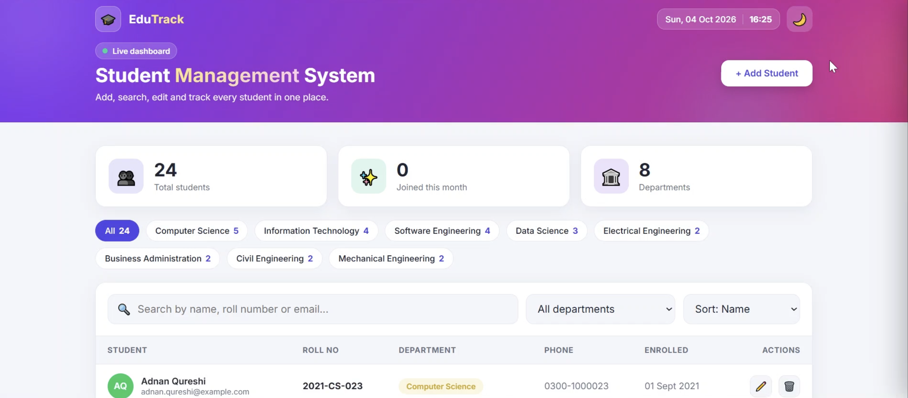

#### Dashboard - Dark
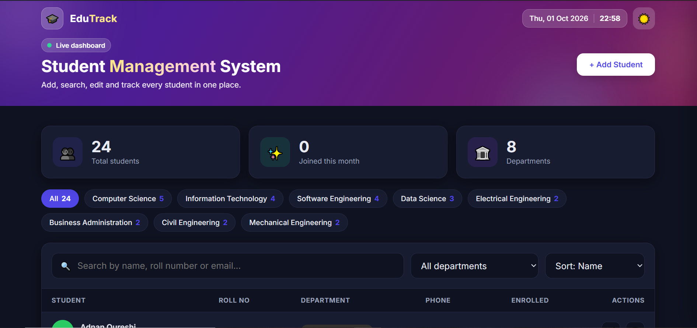

#### Dashboard - Additional View
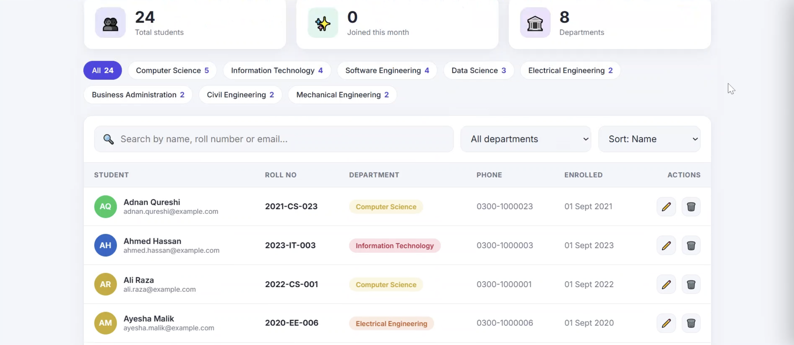


### Student Management

#### Students Data
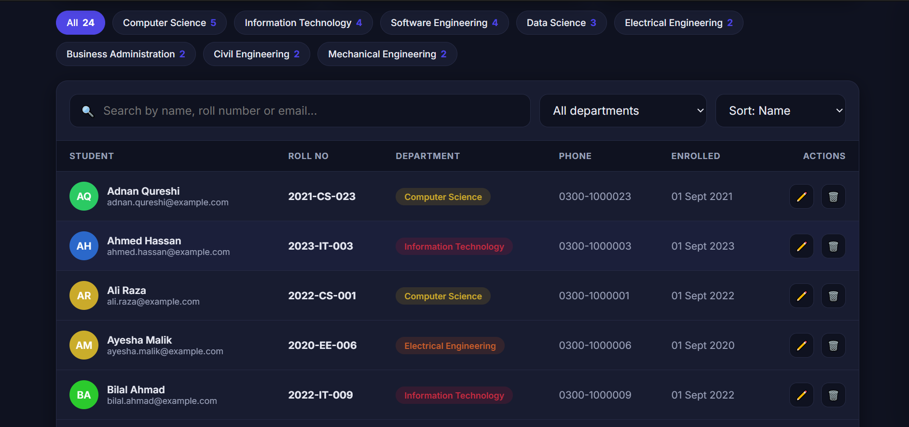

#### Student Details
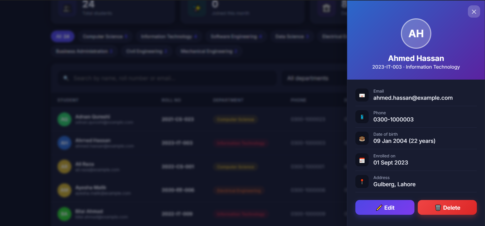

#### Update Student - Light
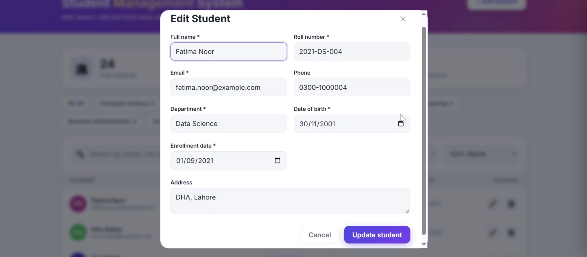

#### Update Student - Dark
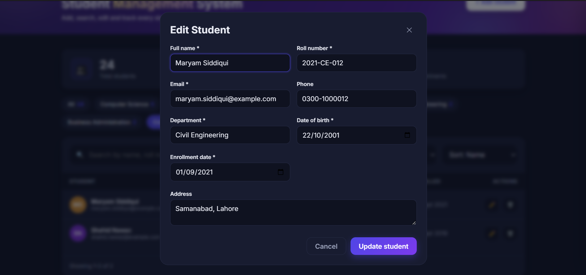

#### Delete Student
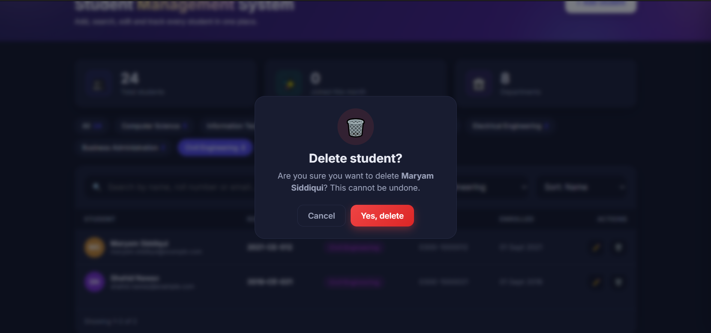


## Responsive Design

The application is fully responsive and optimized for desktop and mobile devices.

### Mobile Dashboard

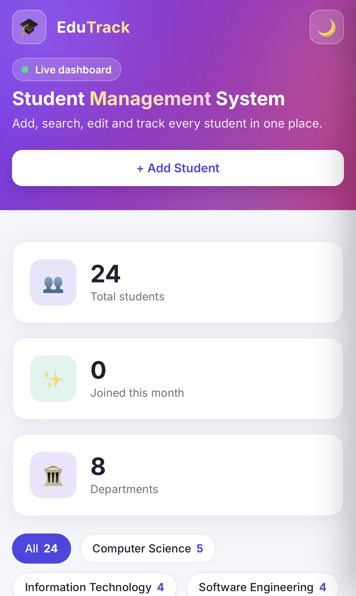


### Mobile Student Management

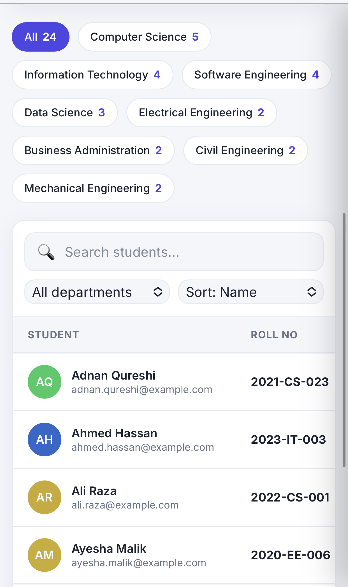

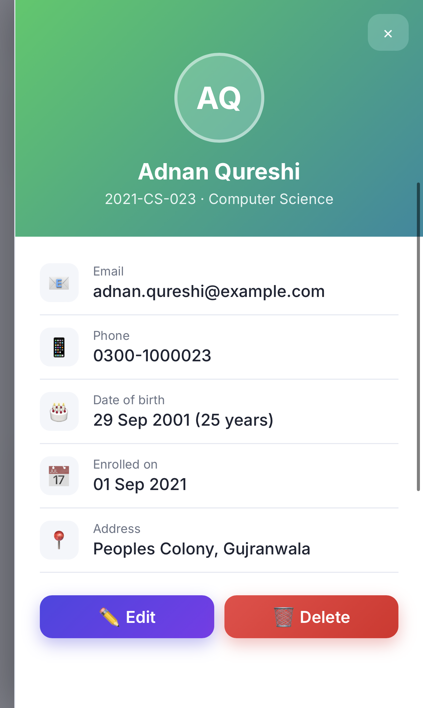

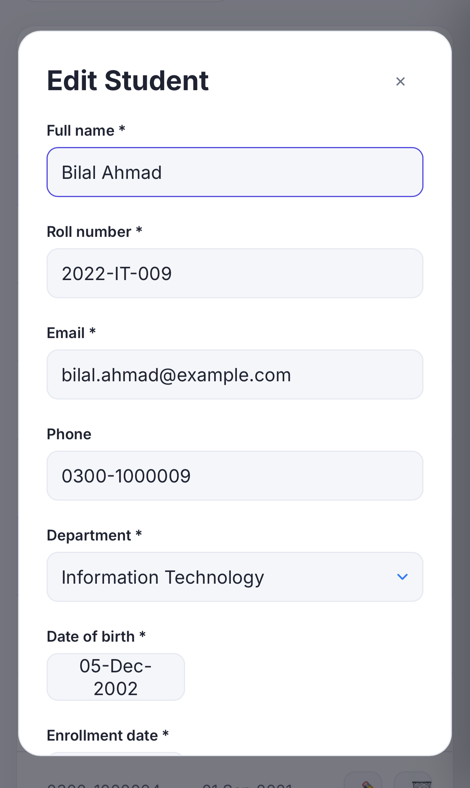

## ⚙️ Getting Started

**You need:** .NET SDK 9 and SQL Server LocalDB.

```bash
git clone https://github.com/Hashim017/student-management-system.git
cd student-management-system
dotnet restore
dotnet run
```

Open the URL shown in the terminal.

## 👤 Author

**Muhammad Hashim** - [GitHub](https://github.com/Hashim017)